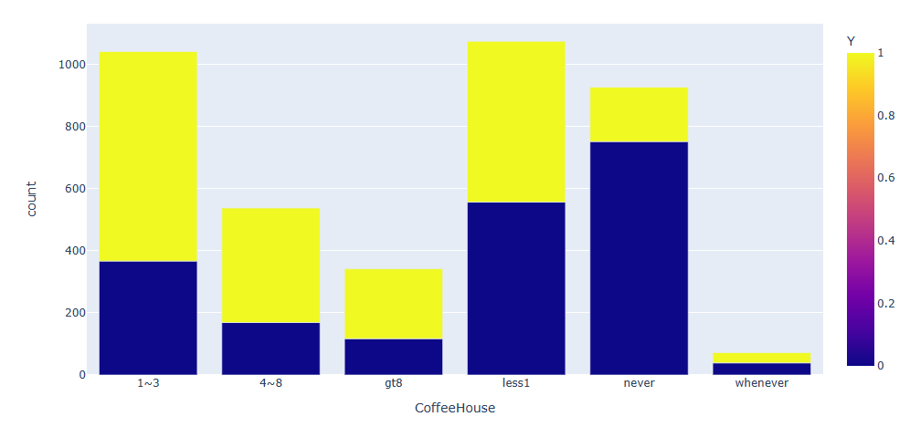

# Practical-Application-Assignment_5_1

## Will a Customer Accept the Coupon?

## Context

Imagine driving through town and a coupon is delivered to your cell phone for a restaraunt near where you are driving. Would you accept that coupon and take a short detour to the restaraunt? Would you accept the coupon but use it on a sunbsequent trip? Would you ignore the coupon entirely? What if the coupon was for a bar instead of a restaraunt? What about a coffee house? Would you accept a bar coupon with a minor passenger in the car? What about if it was just you and your partner in the car? Would weather impact the rate of acceptance? What about the time of day?

Obviously, proximity to the business is a factor on whether the coupon is delivered to the driver or not, but what are the factors that determine whether a driver accepts the coupon once it is delivered to them? How would you determine whether a driver is likely to accept a coupon?

## Overview

The goal of this project is to use what you know about visualizations and probability distributions to distinguish between customers who accepted a driving coupon versus those that did not.

## Data

This data comes to us from the UCI Machine Learning repository and was collected via a survey on Amazon Mechanical Turk. The survey describes different driving scenarios including the destination, current time, weather, passenger, etc., and then ask the person whether he will accept the coupon if he is the driver. Answers that the user will drive there ‘right away’ or ‘later before the coupon expires’ are labeled as ‘Y = 1’ and answers ‘no, I do not want the coupon’ are labeled as ‘Y = 0’. There are five different types of coupons -- less expensive restaurants (under $20), coffee houses, carry out & take away, bar, and more expensive restaurants ($20 - $50).

### Data Descriptions

#### Keep in mind that these values mentioned below are average values.

#### The columns in dataset include:

##### User attributes

    gender: male, female
    age: below 21, 21 to 25, 26 to 30, etc.
    maritalStatus: single, married partner, unmarried partner, or widowed
    has_children: 0, 1, or more than 1
    education: high school, bachelors degree, associates degree, or graduate degree
    occupation: architecture & engineering, business & financial, etc.
    income: 
        'Less than $12500','$12500 - $24999','$25000 - $37499',
        '$37500 - $49999', '$50000 - $62499', '$62500 - $74999', 
        '$75000 - $87499', '$87500 - $99999',  '$100000 or More'
    Bar: 0, less than 1, 1 to 3, 4 to 8 or greater than 8
    CarryAway: 0, less than 1, 1 to 3, 4 to 8 or greater than 8
    CoffeeHouse: 0, less than 1, 1 to 3, 4 to 8 or greater than 8
    RestaurantLessThan20: 0, less than 1, 1 to 3, 4 to 8 or greater than 8
    Restaurant20To50: 0, less than 1, 1 to 3, 4 to 8 or greater than 8

##### Contextual attributes

    destination: home, work, or no urgent destination
    weather: sunny, rainy, or snowy
    temperature: 30F, 55F, or 80F
    time: 10AM, 2PM, or 6PM
    passanger: alone, partner, kid(s), or friend(s)
    Location of user, coupon and destination: we provide a map to show the geographical location of the user, destination, and the venue, and we mark the distance between each two places with time of driving. The user can see whether the venue is in the same direction as the destination.

##### Coupon attributes
    expiration: 2 hours or one day
    coupon: 'Restaurant(<20)', 'Coffee House', 'Carry out & Take away', 'Bar', 'Restaurant(20-50)'
    toCoupon_GEQ5min: 0,1
    toCoupon_GEQ15min: 0,1
    toCoupon_GEQ25min: 0,1
    Y: 0,1

#### Investigate the dataset for missing or problematic data.
##### "passanger" column is misspelled
##### Car column contains "NaN"
##### RestaurantLessThan20 contains "NaN"
##### Restaurant20To50 contains "NaN"

#### Decide what to do about your missing data -- drop, replace, other...
##### rename "passanger" to "passenger" and delete "passanger"
###### replace NaN in the cars column with "four-wheels"
###### replace NaN in the RestaurantLessThan20 column with "whenever"
###### replace NaN in the Restaurant20To50 column with "whenever"

#### What proportion of the total observations chose to accept the coupon? 
**7210 / 12684 = 56.84%**
####  56.84%

#### Use a bar plot to visualize the coupon column.

#### Use a histogram to visualize the temperature column.

#### What proportion of bar coupons were accepted?
**827 / 2017 = 41.00%**
#### 41.00%

#### Compare the acceptance rate between those who went to a bar 3 or fewer times a month to those who went more.
**666 / 153 = 435.29%**
#### 435.29%

#### Compare the acceptance rate between drivers who go to a bar more than once a month and are over the age of 25 to the all others. Is there a difference?
**290 / 535 = 54.21%**
#### 54.21%

#### Use the same process to compare the acceptance rate between drivers who go to bars more than once a month and had passengers that were not a kid and had occupations other than farming, fishing, or forestry.
**391 / 434 = 90.09%**
#### 90.09%

#### Compare the acceptance rates between those drivers who:

##### go to bars more than once a month, had passengers that were not a kid, and were not widowed OR
**391 / 434 = 90.09%**
#### 90.09%

##### go to bars more than once a month and are under the age of 30 
**247 / 578 = 42.73%**
#### 42.73%

##### go to cheap restaurants more than 4 times a month and income is less than 50K
**373 / 1597 = 23.36%**
#### 23.36%

#### Based on these observations, what do you hypothesize about drivers who accepted the bar coupons?
##### Drivers that had a high percenatage rate of accepting the Bar coupon
##### - did not have child passengers
##### - frequented bars more than once a month but not more than three times a month

### Independent Investigation
#### Using the bar coupon example as motivation, you are to explore one of the other coupon groups and try to determine the characteristics of passengers who accept the coupons.

#####  what stands out is that Coffee House coupons are equally accepted and unaccepted more than the other types of coupons

##### a Plotly bar chart shows the same data but it's more interactive!

          
##### a Seaborn bar chart is formats very nicely!    

                                                        
##### the next 2 pie charts are very close and suggest that gender doesn't play a significant role in the when Coffee Houses were visited                        

##### the next 2 pie charts have significant differences and suggest that time of day is a factor of when Coffee House coupons are accepted

#####  This Seaborn Distplot also shows a trend of during the day for Coffee House coupons

##### This Seaborn PairPlot looks like a pegboard.  I think it came out that way because I mapped the strings to numbers.
##### The pattern was uniform and symmetrical which defeats the purpse of trying to use a graph intended for random values.

### Insights
#### The results are interesting but my instincts tell me there's something more than what's on display.
#### We don't know why the unaccepted coupons are not accepted.
#### - Are people ignoring them (email or text)?
#### - Are people routing them to the junk folder?
#### - People are creature of habit and habits can be hard to break, especially coffee.
#### It's great that 50% of the Coffee House coupons are accepted and that's a starting point for improvement.

### Next steps and recommendations
#### I recommend a rewards & loyalty program to get more acceptance of Coffee House coupons and collect more data about it.
#### Giving people an incentive to look at the coupons is half the battle.
#### Just acknowledging the coupon or not send it to the junk folder will go a long way.
#### A program to reward coffee drinkers to accept the coupon, either email or text, and then redeem it can be very successful.
#### Coffee Houses of all sizes (standalone or chain) have loyalty program, but ours could be expanded to other types of establishments.

 
## Link to notebook
### https://github.com/jiml-ng2plus/Practical-Application-Assignment_5_1